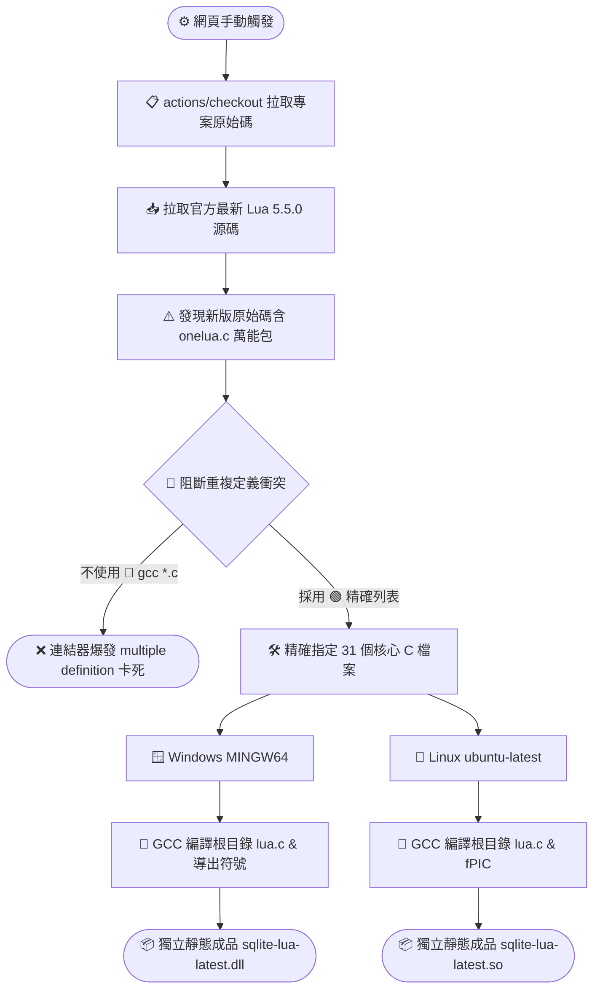

# 🚀 SQLite-Lua 延伸模組：升級 Lua 5.5 靜態編譯指南 (hoelzro 版本)

本文件記錄了如何將 `hoelzro/sqlite-lua-extension` 延伸模組（自帶內嵌 Lua 引擎）升級至最新的 **Lua 5.5 版本**。

在新版架構中，由於 Lua 官方已原生支援 `lua_compare` 與 `LUA_OPEQ` 等現代 API，編譯時**完全不需要再使用任何代碼補丁（Polyfill）**。然而，針對新版原始碼獨有的「一鍵編譯機制」，我們採取了精確排除的編譯策略，以達到全平台（Windows DLL / Linux SO）的純靜態獨立封裝。

---

## 🧱 自動化靜態編譯架構圖 (hoelzro 專用)

---

## 💎 升級至 Lua 5.5 版本的核心優勢

將底層引擎升級至最新世代的 Lua 5.5，能為 `hoelzro` 的直接呼叫架構帶來以下顯著提升：

### 📈 一、極致的記憶體消耗降低（節省 ~60%）
* **技術細節**：Lua 5.5 重構了底層的 Table（雜湊與陣列混合結構）。
* **應用場景**：當您在 SQLite 內反覆調用 `SELECT lua('return ...')` 處理或生成大型 JSON、陣列資料時，虛擬機佔用的資料庫記憶體開銷將會斷崖式下跌，極高地提升了高併發環境下的系統穩定度。

### 🌐 二、更安全的 UTF-8 字串清洗
* **技術細節**：新增內建函數 `string.isutf8` 與增強版 `utf8.offset`。
* **應用場景**：您可以直接下達：
  `SELECT lua('return string.isutf8(text)')` 來過濾或清洗資料庫欄位中的異常多國語言亂碼，完全不需要依賴外部複雜的 C 語言延伸模組。

### 🛠️ 三、完美的代碼純淨度
* **技術細節**：由於原生支援現代 API，工作流移除了所有對原始碼進行 `sed` 強制修改與注入的步驟。
* **應用場景**：您的專案根目錄 `lua.c` 保持 100% 原汁原味，所有的跨平台相容與優化完全由 Actions 與編譯器層級完美搞定。
