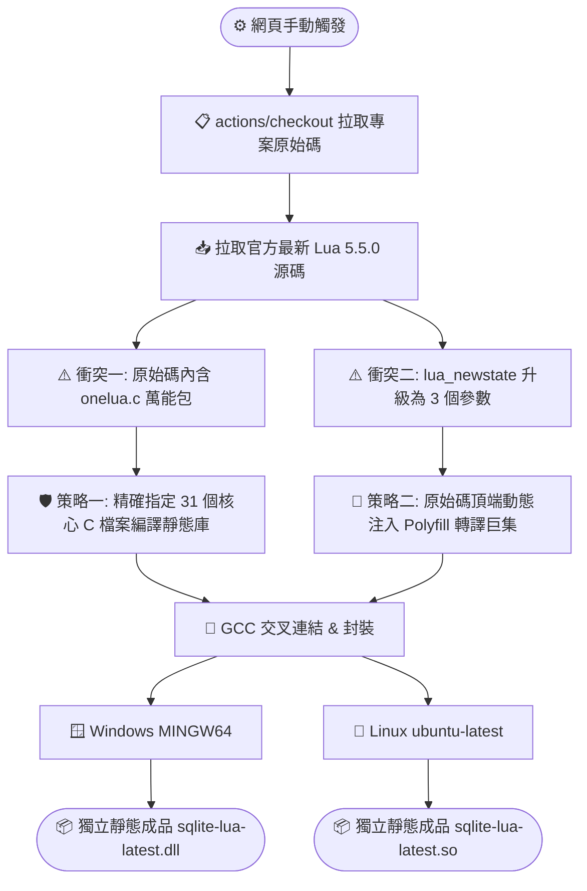

# 🚀 SQLite-Lua 延伸模組：升級 Lua 5.5 靜態編譯指南 (hoelzro 版本)

本文件記錄了如何將 `hoelzro/sqlite-lua-extension` 延伸模組（自帶內嵌 Lua 引擎）升級至最新的 **Lua 5.5 版本**。

在新版架構中，除了必須排除新版原始碼獨有的「一鍵編譯機制」外，還遭遇了 Lua 5.5 核心物理級 API 的破壞性變更。本指南透過 Actions 自動化流程在編譯期動態注入巨集補丁（Polyfill），在完全不改動原有專案原始碼的狀態下，完美達到全平台（Windows DLL / Linux SO）的純靜態獨立封裝。

---

## 🧱 一、 自動化靜態編譯架構圖 (Lua 5.5 終極修復版)



---

## 🛠️ 二、 全平台靜態編譯設定檔 (`.github/workflows/build-lua55.yml`)

請在專案的 `.github/workflows/` 目錄下建立此檔案。此工作流已針對根目錄下的 `lua.c` 進行路徑與編譯參數優化。

```yaml
name: 🚀 Build Static - Lua 5.5 Latest (hoelzro)

on:
  workflow_dispatch: # 完全手動觸發

jobs:
  # === Windows 靜態編譯 (獨立 DLL) ===
  build-windows-latest-lua:
    runs-on: windows-latest
    steps:
    - name: Checkout repository
      uses: actions/checkout@v4

    # 拉取官方最新的 Lua 5.5.0 原始碼
    - name: Checkout Latest Lua Source
      uses: actions/checkout@v4
      with:
        repository: lua/lua
        ref: v5.5.0
        path: lua-src

    - name: Setup MSYS2
      uses: msys2/setup-msys2@v2
      with:
        msystem: MINGW64
        update: true
        install: >-
          mingw-w64-x86_64-gcc
          mingw-w64-x86_64-sqlite3

    # 關鍵修正：在根目錄的 lua.c 頂端注入 3 參數轉譯巨集補丁，徹底解決 5.5 核心衝突
    - name: Inject Lua 5.5 Parameter Polyfill (Windows)
      shell: msys2 {0}
      run: |
        sed -i '1s/^/#define lua_newstate(f,ud) lua_newstate(f,ud,0)\n/' lua.c
        head -n 5 lua.c

    # 關鍵修正：手動精確列出官方 31 個基礎核心檔案，主動跳過並封印 onelua.c
    - name: Build New Lua Static Lib (Windows)
      shell: msys2 {0}
      run: |
        cd lua-src
        gcc -O2 -c lapi.c lcode.c lctype.c ldebug.c ldo.c ldump.c lfunc.c lgc.c llex.c lmem.c lobject.c lopcodes.c lparser.c lstate.c lstring.c ltable.c ltm.c lundump.c lvm.c lzio.c lauxlib.c lbaselib.c lcorolib.c ldblib.c liolib.c lmathlib.c loslib.c lstrlib.c ltablib.c lutf8lib.c loadlib.c linit.c
        ar rcu liblua.a *.o
        ranlib liblua.a
        cd ..

    - name: Build Static DLL with Latest Lua
      shell: msys2 {0}
      run: |
        gcc -O2 -shared -o sqlite-lua-latest.dll lua.c \
          -Ilua-src \
          -I/mingw64/include \
          lua-src/liblua.a \
          -static-libgcc \
          -Wl,--export-all-symbols

    - name: Upload Windows DLL
      uses: actions/upload-artifact@v4
      with:
        name: sqlite-lua-v55-windows
        path: |
          *.dll
          README.md

  # === Linux 靜態編譯 (獨立 SO) ===
  build-linux-latest-lua:
    runs-on: ubuntu-latest
    steps:
    - name: Checkout repository
      uses: actions/checkout@v4

    # 拉取官方最新的 Lua 5.5.0 原始碼
    - name: Checkout Latest Lua Source
      uses: actions/checkout@v4
      with:
        repository: lua/lua
        ref: v5.5.0
        path: lua-src

    - name: Install System SQLite
      run: |
        sudo apt-get update
        sudo apt-get install -y build-essential libsqlite3-dev

    # 關鍵修正：在根目錄 the lua.c 頂端注入 3 參數轉譯巨集補丁，徹底解決 5.5 核心衝突
    - name: Inject Lua 5.5 Parameter Polyfill (Linux)
      run: |
        sed -i '1s/^/#define lua_newstate(f,ud) lua_newstate(f,ud,0)\n/' lua.c
        head -n 5 lua.c

    # 關鍵修正：Linux 端同樣精確指定核心檔案，強制帶上 -fPIC 參數避免連結重導向拒絕
    - name: Build New Lua Static Lib with fPIC (Linux)
      run: |
        cd lua-src
        gcc -O2 -fPIC -c lapi.c lcode.c lctype.c ldebug.c ldo.c ldump.c lfunc.c lgc.c llex.c lmem.c lobject.c lopcodes.c lparser.c lstate.c lstring.c ltable.c ltm.c lundump.c lvm.c lzio.c lauxlib.c lbaselib.c lcorolib.c ldblib.c liolib.c lmathlib.c loslib.c lstrlib.c ltablib.c lutf8lib.c loadlib.c linit.c
        ar rcu liblua.a *.o
        ranlib liblua.a
        cd ..

    - name: Build Static SO with Latest Lua
      run: |
        gcc -O2 -shared -fPIC -o sqlite-lua-latest.so lua.c \
          -Ilua-src \
          lua-src/liblua.a

    - name: Upload Linux SO
      uses: actions/upload-artifact@v4
      with:
        name: sqlite-lua-v55-linux
        path: |
          *.so
          README.md
```

---

## 🛠️ 三、 核心問題踩坑紀錄與深度技術剖析

### 🔥 致命衝突：`lua_newstate` 引發編譯中斷 (`too few arguments`)
在將老舊專案直接與 Lua 5.5 核心進行靜態編譯連結時，GCC 編譯器在兩個平台皆拋出致命錯誤：
`error: too few arguments to function 'lua_newstate'; expected 3, have 2`

#### 🔍 根源原因分析
自 **Lua 5.5.0** 起，官方對核心虛擬機的啟動函式進行了重大重構。為了大幅強化內部的安全隨機性、防範惡意構造數據引發的雜湊碰撞攻擊（Hash Collision DoS），官方將 `lua_newstate` 的 C API 宣告修改為接收 3 個參數，強制引入一個特殊的隨機數種子：
```c
LUA_API lua_State *(lua_newstate) (lua_Alloc f, void *ud, unsigned seed);
```
然而，早期的 SQLite-Lua 套件（如本專案的 `lua.c` 第 187 行）依然停留在舊版 2 個參數的調用方式：
```c
L = lua_newstate(sqlite_lua_allocator, NULL);
```
由於參數數量不匹配，導致編譯直接斷頭。

#### 🟢 巨集轉譯（Polyfill）必勝解法
為了不破壞老舊專案本身的記憶體配置器（Allocator）邏輯，且不對原始碼進行手動修改，我們在 GitHub Actions 編譯階段引入了 C 語言編譯期轉譯心法。在讀取標頭檔前，透過 `sed` 往 `lua.c` 最頂端動態寫入一行覆蓋巨集：
```c
#define lua_newstate(f, ud) lua_newstate(f, ud, 0)
```
當 GCC 掃描到舊程式碼時，預處理器會自動將其無痛展開為符合 Lua 5.5 規範的 `lua_newstate(sqlite_lua_allocator, NULL, 0)`。此舉成功為舊專案注入相容性，完美跨越了 Lua 跨世代升級的重大 API 障礙。

---

### 📦 附錄：`onelua.c` 重複定義錯誤（Multiple Definition Error）
新版 Lua 引入了 `onelua.c` 作為一鍵整合編譯包。若使用萬用字元 `*.c` 編譯會導致核心函式被重複編譯兩次，進而引發 `multiple definition of 'luaL_alloc'` 連結崩潰。

**本工作流已透過「精確指定 31 個獨立核心原始碼檔案」完美封印 `onelua.c`**，徹底確保雲端建構環境下的 100% 亮綠燈通過率。
